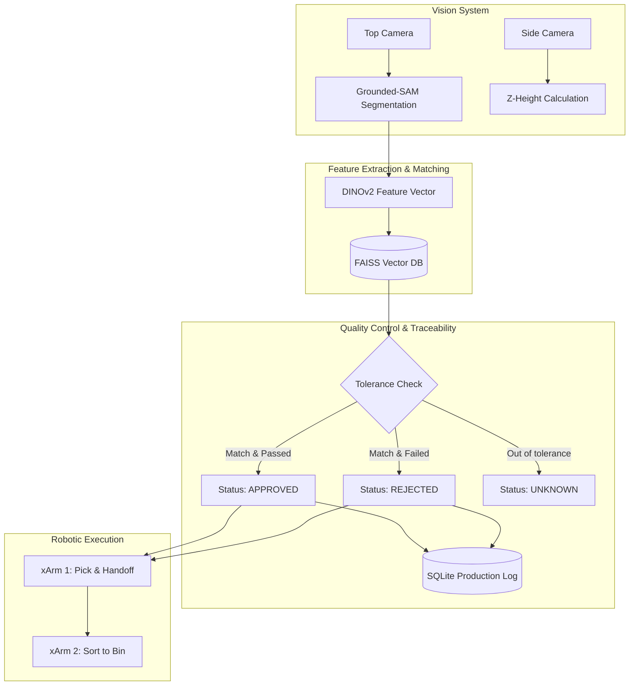

# FrED: Zero-Shot Quality, Traceability & Robotic Control


This project consists in a modular, automated flexible manufacturing pipeline that leverages zero-shot visual inspection for real-time quality control, sorting, and traceability. Developed for Expoingenierías 2026, this system controls a dual-robot setup without the need for traditional model retraining.

---

##  System Architecture

The pipeline seamlessly integrates computer vision, deep learning feature extraction, and distributed robotic control.

### Software Pipeline (Zero-Shot AI)



### Hardware Topology

*   **Robot 1 (Picker):** uFactory xArm Lite 6 (IP: `192.168.0.184`) — Picks the identified part from the workspace and moves it to a fixed handoff point.
*   **Robot 2 (Sorter):** uFactory xArm Lite 6 (IP: `192.168.0.150`) — Retrieves the part from the handoff point and deposits it into the `APPROVED` or `REJECTED` bins.
*   **Vision:** Top camera for X/Y coordinates and bounding boxes; Side camera for dynamic Z-height adjustment.
*   **Calibration:** Homography matrix mapping pixel coordinates to physical robotic workspace dimensions (`matriz_vision_xarm.npy`).

---

##  Key Features

*   **Zero-Shot Registration:** Register new parts in seconds using the CustomTkinter dashboard. No dataset collection or neural network retraining required.
*   **Traceability:** Every pick-and-place event is logged into a local SQLite database (`production_log.db`), tracking timestamps, part names, quality status, feature distances, and physical spatial coordinates.
*   **Dynamic Tolerance:** Adjustable UI sliders to fine-tune Identity Tolerance and Quality Tolerance thresholds on the fly.
*   **Thread-Safe UI:** Asynchronous background processing for AI inference and robotic motion to keep the industrial dashboard smooth and responsive.

---

##  Installation & Setup

### 1. Clone the repository
```bash
git clone https://github.com/yourusername/vision-sorting-pipeline.git
cd vision-sorting-pipeline
```

### 2. Create a Virtual Environment
```bash
python -m venv venv
source venv/bin/activate  # On Windows use: venv\Scripts\activate
```

### 3. Install Dependencies
```bash
pip install -r requirements.txt
```
> **Note:** For optimal performance, ensure you have the appropriate PyTorch version installed with CUDA support.

### 4. Download AI Models
Place the following model weights in the `models/` directory:
*   `groundingdino_swint_ogc.pth`
*   `sam_vit_b_01ec64.pth`

### 5. Run the System
Ensure both uFactory xArms are powered, connected to the local network, and their workspace is clear before starting the system.
```bash
python src/main.py
```

---

##  Project Structure

```text
┣  src/                  
┃ ┣  main.py             # Entry point & thread management
┃ ┣  config.py           # Global constants (IPs, coordinates, UI colors)
┃ ┣  database.py         # ProductionDB class (SQLite)
┃ ┣  robots.py           # RobotMain and RobotSorter classes (xArm SDK)
┃ ┣  vision.py           # SAM, DINOv2, FAISS initialization
┃ ┗  gui.py              # CustomTkinter industrial dashboard
┣  calibration/                  
┃ ┣  calibrate_z.py             # Calibration of the pick height for the xArm
┃ ┣  generatematrix.py           # Matrix generator for translation of X/Y pixels to X/Y coordinates
┃  requirements.txt
┗  README.md             
```

---

##  References & Academic Context

This system was conceptualized and developed as part of a modular, automated flexible manufacturing line concept for Expoingenierías 2026. The project paper details the zero-shot vision integration, coordinate matrix calibration troubleshooting, and the automated sorting pipeline architecture.
